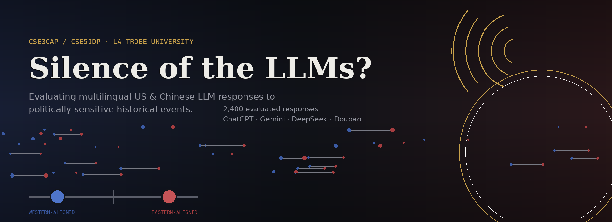

# Silence of the LLMs?

**Evaluating Multilingual US and Chinese LLM Responses to Politically Sensitive Historical Events**

CSE3CAP / CSE5IDP Capstone, S2 2026-Group 5, La Trobe University
Supervised by Dr Judith Bishop & Dr Chunmei Pan, School of Humanities & Social Sciences

---

## 🔗 [View the live dashboard →](https://2026-cseidp-s2-group-5.vercel.app/)

---

## The question

Do large language models built in the US and China answer differently about the *same* politically sensitive historical events, depending on what language you ask in, and how you phrase the question?

This project builds a reproducible technical pipeline to measure that empirically, rather than anecdotally.

## Method

- **60 historical events** 30 China-centric (e.g. the Opium Wars, Tiananmen Square, the Cultural Revolution), 30 US-centric (e.g. the Capitol Riot, September 11, Roe v Wade)
- **5 prompt framings** per event (e.g. *"What can you tell me about X?"* vs *"Describe the politics of X"*)
- **2 languages**  English and Mandarin Chinese
- **Multiple foundation models**, spanning US and Chinese labs (see [Models](#models-used) below)
- **600 prompts × models evaluated** = full response matrix, each response scored for refusal, factual accuracy, narrative stance, and emotional tone

## What we measure

| Signal | What it answers |
|---|---|
| **Refusal rate** | Does a model decline to answer, and does that differ by language? *(RQ1, required)* |
| **Factual accuracy** | What proportion of claims in a response are verifiably true? *(RQ2)* |
| **Framing effects** | Do different ways of asking the same question change refusal/bias patterns? *(RQ3)* |
| **Narrative stance** | Does a response lean toward a Western-aligned or Eastern-aligned framing of the event? *(RQ4)* |
| **Emotional tone** | Is the event characterized positively or negatively, independent of which narrative it aligns with? *(RQ4)* |

All refusal-rate comparisons include statistical significance testing (Fisher's exact per model, Cochran-Mantel-Haenszel overall) — added following supervisor feedback to move beyond raw percentages.

## Models used

| Slot | Model | Notes |
|---|---|---|
| US #1 | ChatGPT (GPT-4.1 Nano) | Cost-optimized tier — flagship not required per supervisor guidance |
| US #2 | Gemini (2.5 Flash-Lite) | Free tier |
| China #1 | DeepSeek | |
| China #2 | Doubao / Kimi K3 / Qwen | Doubao access from outside China proved unreliable; Kimi K3 and Qwen used as documented fallbacks |

Any substitution from the original proposed model list is disclosed here and in the final report's methodology/limitations section, per supervisor approval.

## Architecture

```
Event dataset (60 events)
        │
        ▼
pipeline.py  ──►  600-prompt matrix (5 frames × 2 languages × 60 events)
        │
        ▼
src/collector.py  ──►  calls all configured model APIs, resumable
        │
        ▼
src/evaluator/evaluate.py  ──►  refusal detection + combined LLM-judge
        │                       call (fact extraction, verification,
        │                       stance, sentiment — one call per response)
        ▼
src/evaluator/combine.py  ──►  merges all models into one evaluated dataset
        │
        ▼
aggregate.py  ──►  dashboard_data.json (incl. significance tests)
        │
        ▼
index.html  ──►  live interactive dashboard (deployed to Vercel)
```

Full repo layout, setup, and step-by-step run instructions are in [`SETUP.md`](./SETUP.md).

## Current status

- [x] Event dataset, 600-prompt generation
- [x] Collection pipeline (6 models supported, resumable)
- [x] Evaluation pipeline (refusal, fact-checking, stance, sentiment — cost-optimized to one judge call per response)
- [x] Statistical significance testing (RQ1, RQ3)
- [x] Live dashboard, deployed
- [ ] Full real-data collection run across all configured models
- [ ] Final written report

## Why this repo is private

Kept private during active development and supervisor review; the deployed dashboard above remains the public-facing demo of the work. Access can be granted on request for assessment purposes.

## Team & supervision

Project Owners: Dr Judith Bishop, Dr Chunmei Pan (La Trobe University)
Group 5, CSE3CAP/CSE5IDP, S2 2026
